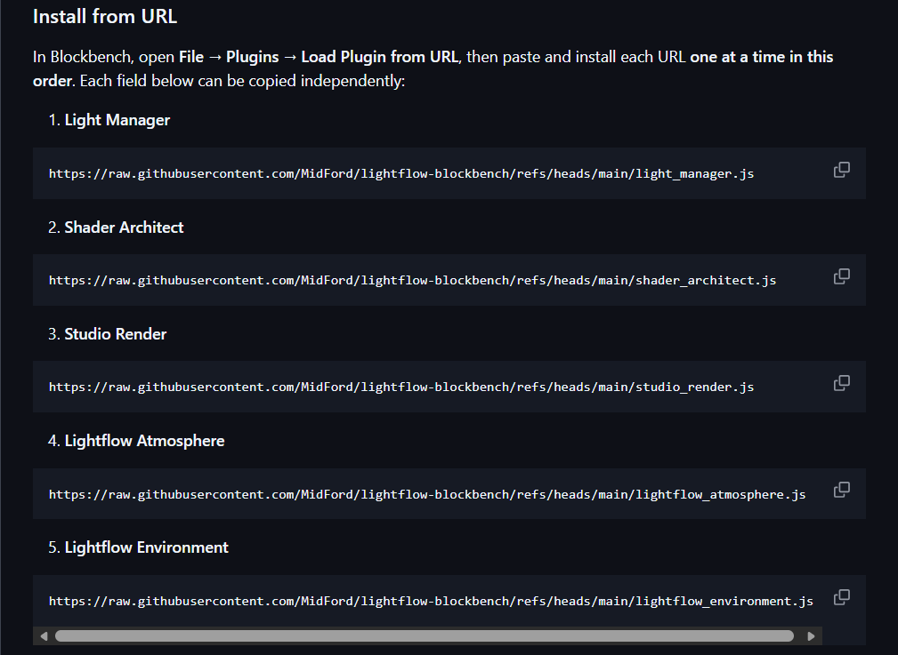

# Introduction to Lightflow

**Rendering is one of the most effective ways to present a model; good lighting and materials can make shapes appear more clearly, add depth, and help viewers understand the form at a glance. The downside is that ‘proper’ 3D rendering  often involve a lot of setup and knowledge (lighting, materials, camera, post-processing) and can be intimidating if you’re primarily focused on modelling.**

Lightflow bridges that gap by bringing a full rendering engine into Blockbench. Instead of exporting to a separate renderer just to get a polished image, you can set up lights and a scene directly alongside your model and still get a high-quality final render.

### Installation

To begin, head to the main page of Lightflow’s GitHub page. Scroll down to the section that says **Install from URL**, and follow the instructions provided there (copy the URL, paste it into Blockbench’s plugin installer, then install/enable the plugin).

If you run into issues, double-check that:

- You’re using the correct URL from the official Lightflow GitHub page,
- Blockbench is up to date
- You’ve made sure that you haven’t accidentally left out a vital module or pasted a link twice

**Each module serves a different purpose, and not all of them need to be installed at once for Lightflow to still be useful.** If you’re on a lower-end device (or you just want a simpler workflow), it’s often better to start with the essentials and only add heavier modules once you know you need them.

A good “start small” approach is:

1. Install the core Light manager module first alongside Shader architect and Studio Render.
2. Understand how each module works
3. Add environment/atmosphere tools later once you’re comfortable.

### Light manager

Light manager is the central module that the rest of Lightflow depends on. It provides the core UI for creating and managing lights and adds the main rendering engine used for reading lighting. It should always be installed first.

### Environment

This module is focused on adding a HDRI (ambient lighting) and dynamic, Minecraft inspired time controls. In practice, this is where you’d go to adjust broad world lighting, sky gradients, cloud/sky visuals, and reflections.

### Shader Architect

This is one of the key modules of Lightflow if you want better-looking materials. It’s used to customise material settings for your project. Presets can help you get started quickly, and you can then tweak the look to suit your style—e.g., more stylised shading, outlines/rim lighting, or other material effects that can make a render stand out. 

### Atmosphere

Lightflow atmosphere adds volumetric-style effects (fog/mist/cloud volume) that help with depth and mood. These effects can be the most performance-heavy, because they often require additional rendering work to simulate “light in the air”. If your device struggles, use it sparingly: keep the effect subtle, reduce quality settings where possible, and only enable it when you’re doing final look-dev or exporting a render.

### Studio Render

Studio render is for producing higher-quality final images. The idea is that you can keep your modelling session lighter, then switch to a “final render” mode when you’re ready to export. This is also where post-processing effects (like bloom) typically come into play, which can add polish—just be careful not to overdo it, as heavy post-processing can hide issues with lighting/materials that are worth fixing directly.

# The basics of rendering

**Rendering is normally a complex skill to master, but Lightflow simplifies the workflow so you can focus on the fundamentals: lighting direction, brightness balance, colour, and materials. Even with easier tools, the quality of a render still comes down to your decisions. So it’s definitely worth learning a few core concepts and building from there.**

## Lights

Lights are the key to any Lightflow render. Without them, the model will be flat and dark with no shadows or highlights. To fix this, click the arrow next to the **Add element** button (the + sign) and click **Add Directional Light**

This creates a light that illuminates everything along the direction indicated by the box around it. In many cases, a single directional light can carry the whole render. This light can be moved direction by dragging the blue dot, changed size by dragging the purple dots, and changed length by dragging the red dot.

We will now set this up as the **key light**; this is the light that creates shadow and lights up the scene. If you want to create adequate lighting for a scene, the key light should come diagonally from a certain point. Personally, I like to set the position of the light from the front left. That’s the same angle that light should come from when creating Minecraft-style sprites If that doesn’t make sense, add these values in the **Transform** tab to perfectly centre the light from this angle.

Now, in most cases, a key light is more than fine for an isometric render. But if you want more detail and less harsh shadows, add a second light as a **fill light** coming from the opposite side. A fill light is usually dimmer and softer than the key light: its job is to lift shadow detail without removing shadows entirely.

This is also a great opportunity to add subtle colour variation; blending different colours from two directions can really make the texture stand out chromatically and can help the render pop.

Below is an example showcasing this. While subtle, it can be amplified by saturating the colours more and brightening the key light. On the second image, I use a half-saturated bright yellow and a low saturated darker blue. 

You may be wondering how you even change the colours in the first place, and that’s okay. Here’s how. The lights themselves can be edited by right-clicking them and clicking **Light Properties**. This opens a menu showing the current properties of the selected light. Some settings like bias or range can sound technical, but you don’t need to perfect everything for a simple showcase render. These more complex settings are either used for high-precision technical renderings, troubleshooting and bug fixes, or just for perfectionist renderers who really want to bring the best out of this program. If you do want to learn more about these though, more will be published on seperate docs so you can find out about them.

Some of these settings are very necessary, such as softness, brightness, and colour. Each is quite intuitive - Softness indicates how hard or soft shadows are, brightness affects the brightness of the light, and colour changes what colour the light is tinted and therefore what the model below will be tinted.

Regardless, here is a list of what each major setting does, put simply from the top of the settings UI to the bottom.

#### Quick setup

This is just a way of picking a preset for light; each does exactly what it says it will and can be very informative to experiment with.

#### Light type

This changes what type of light we are using - just like the different types of light you will see in the **Add elements** section. 

#### Colour

The colour that is projected onto the path of the light.

#### Brightness

This affects the brightness of the light, going from off (0), neutral (1), and then to opening an app in light mode at 3am (10). Obviously, there are values in between.

#### Range

This sets a physical limit to the light’s distance, and past that point it will have no effect. When the value is 0, it has no limit.

#### Softness

This effects how the edge of the shadows blend. At low values, it has a hard edge, or a slightly blurred edge. At higher values, the edges of the shadows become more indistinguishable

#### Bias

Think of shadows being cast onto models as a new cube being added directly on top of an existing cube - if the distance value is exactly on top, it will create Z-fighting, which is where you may see flickering between the two textures. If there is a slight offset (bias), then there will be no fighting, or ‘acne’.

Like I said, I have left out a few settings that aren’t immediately necessary for a beginner overview, so if you are curious, check out around the wiki to find more. And with that, let’s move on to the next aspect of Lightflow renders, and possibly the most visibly distinguishable.

## Shaders